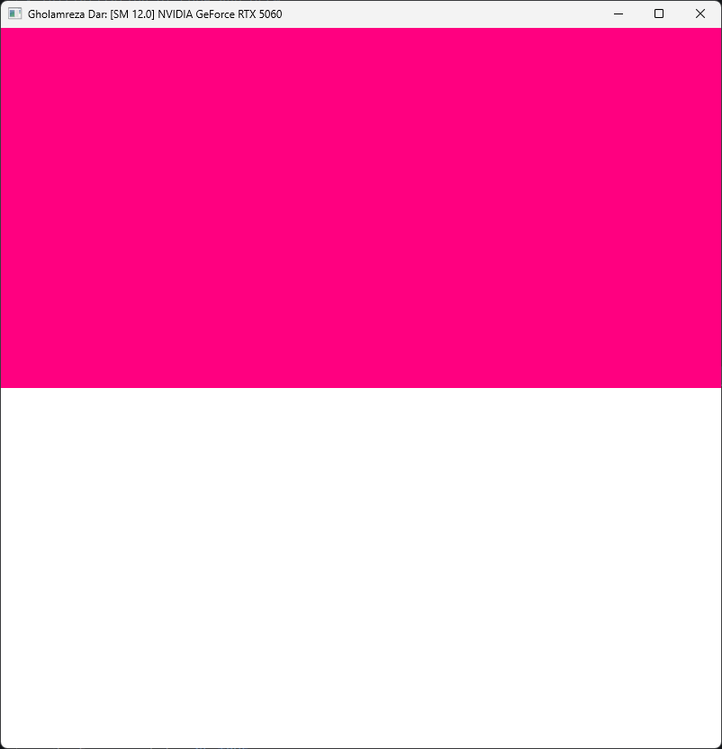
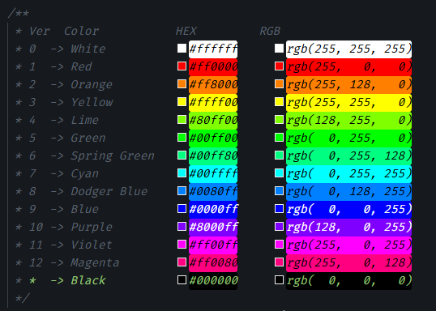

# Project 0 Getting Started

**University of Pennsylvania, CIS 5650: GPU Programming and Architecture, Project 0**

- Gholamreza Dar
- Tested on: Windows 11, i5-14600KF @ 3.5GHz 16GB, RTX 5060 8GB SM 12.0 (Personal)

## 1. Cuda GL Check

- [x] WebGL 1, 2
- [x] WebGPU
- [x] OpenGL
- [x] CUDA

Color verification: Major 12, Minor 0 (Magenta, White)

## 2. Cuda Introduction

TODO