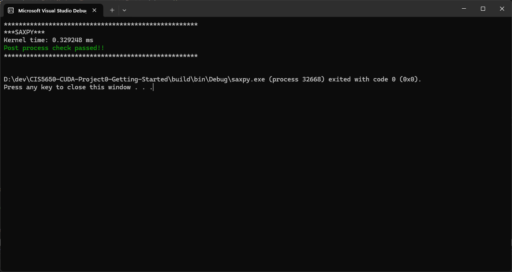
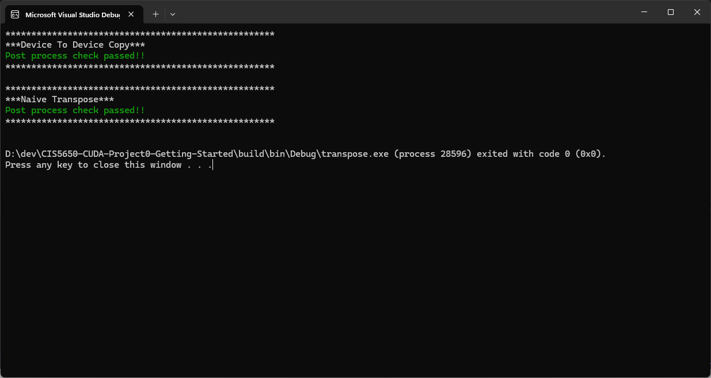
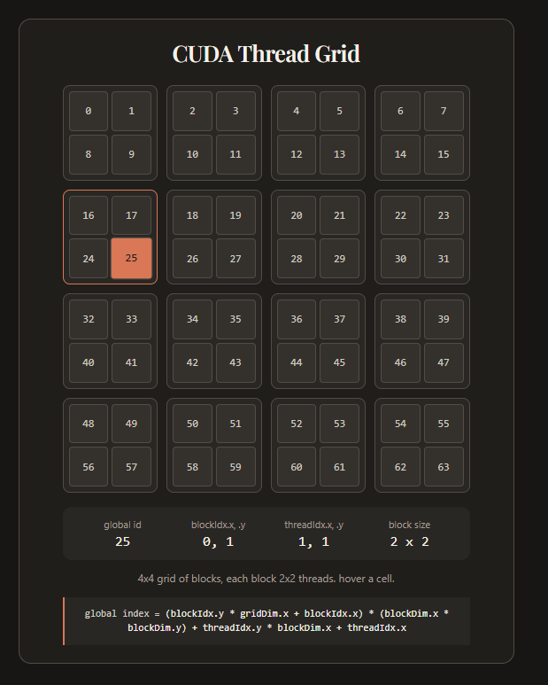

# Project 0 Getting Started

**University of Pennsylvania, CIS 5650: GPU Programming and Architecture, Project 0**

- Gholamreza Dar
- Tested on: Windows 11, i5-14600KF @ 3.5GHz 16GB, RTX 5060 8GB SM 12.0 (Personal)

## 1. Cuda GL Check

- [x] WebGL 1, 2
- [x] WebGPU
- [x] OpenGL
- [x] CUDA


Color verification: Major 12, Minor 0 (Magenta, White)


### Device Query

```txt
deviceQuery.exe Starting...

 CUDA Device Query (Runtime API)

Detected 1 CUDA Capable device(s)

Device 0: "NVIDIA GeForce RTX 5060"
  CUDA Driver Version / Runtime Version          13.1 / 12.8
  CUDA Capability Major/Minor version number:    12.0
  Total amount of global memory:                 8151 MBytes (8546484224 bytes)
MapSMtoCores for SM 12.0 is undefined.  Default to use 128 Cores/SM
MapSMtoCores for SM 12.0 is undefined.  Default to use 128 Cores/SM
  (30) Multiprocessors, (128) CUDA Cores/MP:     3840 CUDA Cores
  GPU Max Clock rate:                            2565 MHz (2.57 GHz)
  Memory Clock rate:                             14001 Mhz
  Memory Bus Width:                              128-bit
  L2 Cache Size:                                 25165824 bytes
  Maximum Texture Dimension Size (x,y,z)         1D=(131072), 2D=(131072, 65536), 3D=(16384, 16384, 16384)
  Maximum Layered 1D Texture Size, (num) layers  1D=(32768), 2048 layers
  Maximum Layered 2D Texture Size, (num) layers  2D=(32768, 32768), 2048 layers
  Total amount of constant memory:               zu bytes
  Total amount of shared memory per block:       zu bytes
  Total number of registers available per block: 65536
  Warp size:                                     32
  Maximum number of threads per multiprocessor:  1536
  Maximum number of threads per block:           1024
  Max dimension size of a thread block (x,y,z): (1024, 1024, 64)
  Max dimension size of a grid size    (x,y,z): (2147483647, 65535, 65535)
  Maximum memory pitch:                          zu bytes
  Texture alignment:                             zu bytes
  Concurrent copy and kernel execution:          Yes with 1 copy engine(s)
  Run time limit on kernels:                     Yes
  Integrated GPU sharing Host Memory:            No
  Support host page-locked memory mapping:       Yes
  Alignment requirement for Surfaces:            Yes
  Device has ECC support:                        Disabled
  CUDA Device Driver Mode (TCC or WDDM):         WDDM (Windows Display Driver Model)
  Device supports Unified Addressing (UVA):      Yes
  Device supports Compute Preemption:            Yes
  Supports Cooperative Kernel Launch:            Yes
  Supports MultiDevice Co-op Kernel Launch:      No
  Device PCI Domain ID / Bus ID / location ID:   0 / 1 / 0
  Compute Mode:
     < Default (multiple host threads can use ::cudaSetDevice() with device simultaneously) >

deviceQuery, CUDA Driver = CUDART, CUDA Driver Version = 13.1, CUDA Runtime Version = 12.8, NumDevs = 1, Device0 = NVIDIA GeForce RTX 5060
Result = PAS
```

## 2. Cuda Introduction

### SAXPY (Single Precision AX+Y)



### Copy and Transpose



A mistake I made that cost me an hour of debugging was forgetting to multiply array size by `sizeof(float)` in `cudaMemCpy`!

```C
CUDA(cudaMemcpy(d_a, a, sizeX * sizeY * sizeof(float), cudaMemcpyHostToDevice));
```

This results in no error or warning, the kernel runs correctly as well, but only the first 1/4 of the array is read from and written to.

I also made this visualization for understanding and debugging the cell positions using Claude.

Its available in the `/visualizations` dir.



### Matmul

#### Naive

TODO

#### Tiled

TODO